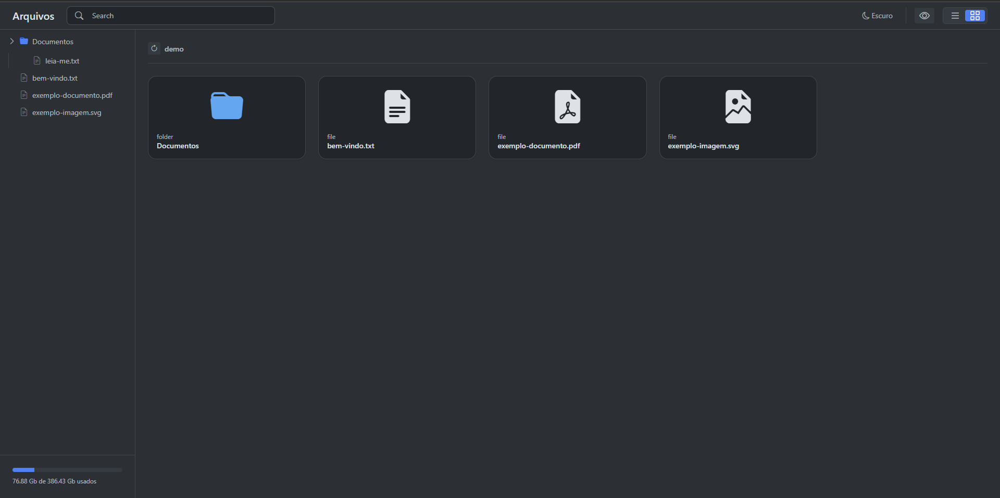

# Archive Manager

Gerenciador de arquivos via navegador: navega, cria, faz upload e visualiza arquivos e pastas direto do disco do servidor, sem passar por um banco de dados. Construído com Laravel no backend e Vue 3 + Inertia no frontend, numa única aplicação sem API REST separada.

## Demonstração



Demo ao vivo: [ADICIONAR LINK]

## Funcionalidades

- Navegação pelos diretórios do disco a partir da própria URL (`/{caminho}`), com breadcrumb clicável e uma árvore de pastas na barra lateral.
- Listagem de arquivos e pastas em grade, com ícone específico por extensão (PDF, Word, Excel, imagem, áudio, vídeo, código, compactado etc).
- Criação de arquivo ou pasta na pasta atual, com validação de nome duplicado antes de gravar no disco.
- Upload de arquivo para a pasta atual, com barra de progresso e mensagem de erro inline quando já existe um arquivo com o mesmo nome.
- Visualização de arquivo sem precisar baixar: texto, imagem, PDF, vídeo e áudio abrem direto num modal; para os demais tipos o modal avisa que não há pré-visualização disponível.
- Download de qualquer arquivo do diretório atual.
- Espaço livre e total do disco exibido na barra lateral.
- Alternância entre tema claro e escuro.

Renomear e excluir arquivos/pasta já têm rota e lógica prontas no backend (`PUT`/`DELETE /estrutura`, tratando nome duplicado e item inexistente), mas a integração dessas ações no menu de contexto do frontend ainda está incompleta.

## Tecnologias

**Backend**
- PHP 8.3+
- Laravel 13
- Inertia.js (adapter `inertiajs/inertia-laravel` 3.1)
- Ziggy 2.6 — expõe as rotas nomeadas do Laravel para o JS
- SQLite — usado só para sessão, cache e fila do próprio Laravel; os arquivos e pastas não passam por banco de dados, são lidos e gravados direto no disco via Laravel Filesystem

**Frontend**
- Vue 3.5 (`<script setup>`, TypeScript)
- Inertia.js para Vue 3
- Vite 8
- PrimeVue 4.5 (Dialog, Breadcrumb, ContextMenu)
- Bootstrap 5.3 + Bootstrap Icons — base da interface
- Tailwind CSS 4 (via `@tailwindcss/vite`)
- VueUse 14.3
- Axios

## Como rodar localmente

O disco usado pela aplicação (`c-drive`, em `config/filesystems.php`) aponta direto para a raiz do disco `C:\`, então hoje o projeto foi pensado para rodar em Windows. Além disso, a rota inicial redireciona para `/Temp`, então é preciso existir uma pasta `C:\Temp` — é ela que a aplicação abre por padrão e usa para montar a árvore da barra lateral.

```bash
# 1. Clonar o repositório
git clone [ADICIONAR LINK] archive-manager
cd archive-manager

# 2. Instalar dependências PHP
composer install

# 3. Configurar o ambiente
cp .env.example .env
php artisan key:generate

# 4. Criar o banco SQLite (usado só por sessão/cache/fila)
touch database/database.sqlite
php artisan migrate

# 5. Instalar dependências JS
npm install

# 6. Garantir que existe a pasta raiz esperada pela aplicação
#    (no Windows, crie manualmente se ainda não existir)
mkdir C:\Temp

# 7. Subir o projeto (servidor, fila, logs e Vite juntos)
composer run dev
```

Com isso, a aplicação fica disponível em `http://localhost:8000`.

## Decisões técnicas

Não existe uma tabela de "arquivos" no banco — toda leitura e escrita passa direto pelo `Storage::disk('c-drive')` do Laravel, então o disco é a única fonte de verdade e não há risco de o banco ficar dessincronizado com o que está no filesystem. O SQLite fica reservado só para o que é do próprio framework (sessão, cache, fila).

Erros de domínio (nome duplicado, item que já não existe mais) são `RuntimeException` lançadas nos models (`Estrutura`, `File`) e capturadas no controller, que devolve o erro via `withErrors()` do Inertia. Isso deixa a mensagem específica chegando pronta no `form.errors` do Vue, sem precisar montar tratamento de erro manual em cada componente.

## Autor

**Davi Hely**

- LinkedIn: [ADICIONAR LINK]
- Portfólio: https://davihely.github.io/profile-page
